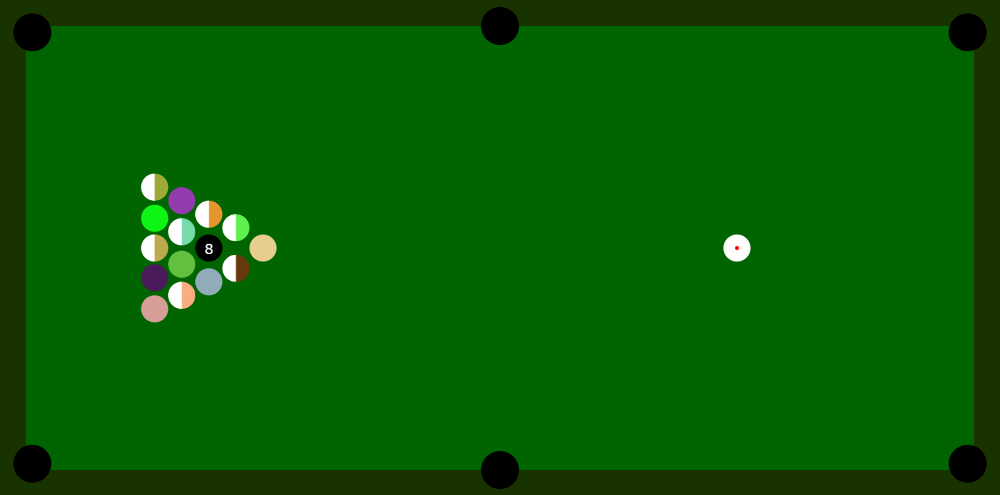

# Pool Game

*Created in 2017* 
A very basic (bit buggy) web based game of 8 ball pool. 
It's one of my first javascript games created. 
Written in pure `javascript` and `html`.

# How to run
You can run this game by opening the [index.html](./index.html) in your browser or you can run a simple http server in the root folder of this repo e.g. (in python) `python -m http.server`

# Controls
`mouse` you can click on the ball and drag the line backwards. The ball will follow the direction of the line and the further it was dragged back the harder it will shoot. 
`r` restart the game.
